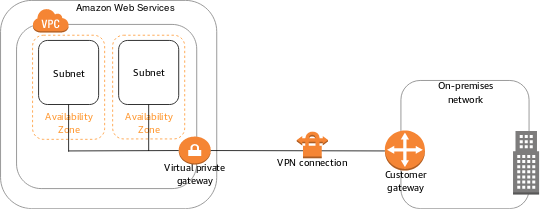

## AWS Cloudtrail
AWS Cloudtrail logs the AWS API activities from Console, SDK, CLI and AWS Services eg. create Bucket, launch EC2 etc.  
CloudTrail EventLogs has
* CloudTrail Management Events -> Create VPC, Create S3 Bucket...
* CloudTrail Data Events -> Get S3 Objects, List S3 Objects...

We can add EventBridge rules eg

## AWS Security Hub
Security Hub is a central security tool which aggregates alerts from other Security Tools like GuardDuty, Inspector, Macie, IAM Access Analyzer, AWS Systems Manager, AWS Firewall Manager, AWS Partner Network Solutions

**We must first enable the AWS Config Service to use Security Hub**

When setting up Security Hub, we must enable/disable security standards like: 
* CIS AWS Foundations,
* PCI DSS
* AWS Foundational Security Best Practices


## AWS Config
AWS Config manages rules which define a set of desired configuration settings. The pre-built AWS rules (over 75) evaluate provisioning and configuring of AWS resources. 
eg. 
* Ensure Lambda functions are deployed inside a VPC, 
* Enable backups for RDS DB instances, 
* Disable public read for S3 bucket
* Audit IAM Policies 
* Detect if CloudTrail has been disabled 
* Detect if EC2 instances are created with unapproved AMIs 
* Detect if Security Groups are open to the public 
* Detect if Internet Gateway is added to unauthorized VPC 
* Detect if EBS volumes are encrypted 
* Detect if RDS databases are public

AWS Config also has the ability to **record changes to the configuration of your IAM users, groups, and roles and the policies associated with them.**  
AWS Config automatically records changes to any of these resources, and gives you a full history of the previous configurations for these resources.  
With this information, you can determine, for example, if an IAM user has used policies that gave him access to certain resources or if certain actions were permitted at any point in the past.  
The AWS Config console includes a timeline view of this information.


## AWS GuardDuty 
AWS GuardDuty is a **MACHINE LEARNING** based anomaly and threat detection service to identify suspicious activity, such as unauthorized access attempts and malicious IP addresses.  
It monitors
* CloudTrail EventLogs, 
* VPC Flow Logs
* DNS Logs
* Kubernetes Audit Logs
* **Can protect against CryptoCurrency attacks** (has a dedicated “finding” for it)


## AWS Inspector
Amazon Inspector only **evaluates EC2 instances, Container Images & Lambda functions** for software vulnerabilities (against database of CVE) and unintended network exposure.


## AWS Detective
AWS Detective provides investigative process with prebuilt data aggregations, summaries, and context for DEEP root cause analysis   
It automatically collects and processes events from VPC Flow Logs, CloudTrail, and GuardDuty to create a unified view


## AWS Trusted Advisor
AWS Trusted Advisor analyses your AWS account and provides Free recommendations for
1. **Cost Optimization**: eg. low utilization EC2 instances, idle load balancers, under-utilized EBS volumes… , Reserved instances & savings plans optimizations, 
2. **Performance**: eg High utilization EC2 instances, CloudFront CDN optimizations, EC2 to EBS throughput optimizations, Alias records recommendations
3. **Security**: MFA enabled on Root Account, IAM key rotation, exposed Access Keys, S3 Bucket Permissions for public access, security groups with unrestricted ports 
4. **Fault Tolerance**: EBS snapshots age, Availability Zone Balance, ASG Multi-AZ, RDS Multi-AZ, ELB configuration… 
5. **Service Limits**


## Penetration Testing on AWS Cloud
AWS customers are welcome to carry out security assessments or penetration tests against their AWS infrastructure without prior approval for 8 services:
* Amazon EC2 instances, NAT Gateways, and Elastic Load Balancers
* Amazon RDS
* Amazon CloudFront
* Amazon Aurora
* Amazon API Gateways
* AWS Lambda and Lambda Edge functions
* Amazon Lightsail resources
* Amazon Elastic Beanstalk environments

#### Prohibited Activities
* DNS zone walking via Amazon Route 53 Hosted Zones
* Denial of Service (DoS), Distributed Denial of Service (DDoS), Simulated DoS, Simulated DDoS
* Port flooding
* Protocol flooding
* Request flooding (login request flooding, API request flooding)


## AWS Audit Manager
AWS Audit Manager maps your compliance requirements to AWS usage data with prebuilt and custom frameworks and automated evidence collection to generate compliance reports alongside evidence folders. Prebuilt Feameworks include
* CIS AWS Foundations Benchmark 1.2.0 & 1.3.0
* General Data Protection Regulation (GDPR),
* Health Insurance Portability and Accountability Act (HIPAA)
* Payment Card Industry Data Security Standard (PCI DSS) v3.2.1
* Service Organization Control 2 (SOC 2)


## VPC Flow Logs
VPC Flow Logs capture information about IP traffic going into interfaces (to either Cloudwatch or S3) at either
* VPC Level
* Subnet Level
* Elastic Network Interface (ENI) level


### * VPC Flow Logs - The following traffic is NOT CAPTURED
* Traffic to Amazon DNS server (custom DNS server traffic is logged)
* Traffic for Amazon Windows license activation
* Traffic to and from 169.254.169.254 for EC2 instance metadata
* Traffic to and from 169.254.169.123 for Amazon Time Sync service
* DHCP traffic
* Mirrored traffic
* Traffic to the VPC router reserved IP address (e.g., 10.0.0.1)
* Traffic between VPC Endpoint ENI and Network Load Balancer ENI


## AWS Macie
AWS Macie Used to analyze and identify sensitive data in your S3 buckets usin
1. **Managed Data Identifier** - > A set of built-in criteria that are designed to detect specific type of sensitive data e.g. credit cards numbers, AWS Credentials, bank accounts
2. **Custom Data Identifier** -> A set of criteria that you define to detect sensitive data using Regular expression, keywords eg. employee IDs, customer account numbers  
You can use Allow Lists to define a text pattern to ignore (e.g., public phone numbers)


## Unified CloudWatch Agent
Collect additional system-level metrics such as RAM, processes, used disk space, etc from EC2 instances, on-premises servers, …)
No logs from inside your EC2 instance will be sent to CloudWatch Logs without using an agent


## AWS Athena
Amazon Athena – Federated Query allows you to run SQL queries across data stored in relational, non-relational, object, and custom data sources (AWS or on-premises). It uses Data Source Connectors that run on AWS Lambda to run Federated Queries (e.g., CloudWatch Logs, DynamoDB, RDS, …) and stores the results back in Amazon S3.


## AWS Site to Site VPN
AWS Site to Site VPN connects AWS VPC to Customer On-Premise VPC using
1. **Virtual Private Gateway(VGW)** is created and attached to the AWS VPC from which you want to create the Site-to-Site VPN connection
2. **Customer Gateway (CGW)** is Software application or physical device on customer side of the VPN connection

Route Propagation or VPG must be ENABLED in the route table associated with your subnets



## AWS VPN CloudHub

Customer networks can communicate with each other also, if connected to the same VGW
We need to enable dynamic routing and configure route tables


## AWS S3 Access Points
AWS S3 Access Points simplify security management for S3 Buckets,   
Each access point has
1. its own DNS name (Internet Origin or VPC Origin)
2. an access point policy (similar to bucket policy) – manage security at scale

1. If using VPC Endpoint, we must enable VPC Endpoint to access Access Point via Endpoint Policy
2. When using S3 Access Point, we can enable all S3 API calls to use Access Point only, hence enforcing VPC Endpoints to interact with S3 bucket


## Providing access to third parties to your AWS Account
For example, a third party might provide a service for managing your AWS resources. With IAM roles, the third party can access your AWS resources by assuming a role that you create in your AWS account. 

Third parties must provide you with the following information for you to create a role that they can assume:
* The third party's AWS account ID. You specify their AWS account ID as the principal when you define the trust policy for the role.
* An external ID to uniquely associate with the role. The external ID can be any identifier that is known only by you and the third party. For example, you can use an invoice ID between you and the third party, but do not use something that can be guessed, like the name or phone number of the third party. You must specify this ID when you define the trust policy for the role. The third party must provide this ID when they assume the role.
* The permissions that the third party requires to work with your AWS resources. You must specify these permissions when defining the role's permission policy. This policy defines what actions they can take and what resources they can access.

After you create the role, you must provide the role's Amazon Resource Name (ARN) to the third party. They require your role's ARN in order to assume the role.

```text
{
  "Version": "2012-10-17",
  "Statement": {
    "Effect": "Allow",
    "Principal": {
      "AWS": "Example Corp's AWS Account ID"
    },
    "Action": "sts:AssumeRole",
    "Condition": {
      "StringEquals": {
        "sts:ExternalId": "12345"
      }
    }
  }
}
```


# AWS S3 Glacier Vault
A S3 Glacier Vault is a container for storing archives. 

**S3 Glacier Vault Lock** helps you to easily enforce compliance controls for S3 Glacier vaults with a Vault Lock policy. You can 
* specify controls such as "write once read many" (WORM) in a Vault Lock policy and 
* lock the policy from future edits.
* Block an object version deletion for a specified amount of time
* Put a **Legal Hold** (which add a Resource Tag based Policy)
  * protect the object indefinitely, independent of retention period 
  * can be freely placed and removed using the s3:PutObjectLegalHold IAM permission
* When we initiate a lock by attaching a vault lock policy to your vault, which sets the lock to an in-progress state and returns a lock ID. **While in the in-progress state, you have 24 hours to validate your vault lock policy before the lock ID expires.**


As an example of a Vault Lock policy, suppose that you are required to retain archives for one year before you can delete them. 
To implement this requirement, you can create a Vault Lock policy that denies users permissions to delete an archive until the archive has existed for one year. 
You can test this policy before locking it down. After you lock the policy, the policy becomes immutable

```text
{
   "Version":"2012-10-17",
   "Statement":[
      {
         "Sid": "deny-based-on-archive-age",
         "Principal": "*",
         "Effect": "Deny",
         "Action": "glacier:DeleteArchive",
         "Resource": [
            "arn:aws:glacier:us-west-2:123456789012:vaults/examplevault"
         ],
         "Condition": {
            "NumericLessThan" : {
                  "glacier:ArchiveAgeInDays" : "365"
                  }
         }
      }
    ]
}       
```

Suppose that you have a time-based retention rule that an archive can be deleted if it is less than a year old.  
At the same time, suppose that you need to place a legal hold on your archives to prevent deletion or modification for an indefinite duration during a legal investigation.   
**In this case, the legal hold takes precedence over the time-based retention rule specified in the Vault Lock policy.**

```text
 {
   "Version":"2012-10-17",
   "Statement":[
      {
         "Sid": "lock-vault",
         "Principal": "*",
         "Effect": "Deny",
         "Action": [ "glacier:DeleteArchive" ],
         "Resource": [ "arn:aws:glacier:us-west-2:123456789012:vaults/examplevault" ],
         "Condition": {
            "StringLike": {
               "glacier:ResourceTag/LegalHold": [ "true" ]
            }
         }
      },
      {
         "Sid": "you-can-delete-archive-less-than-1-year-old",
         "Principal": { "AWS": "arn:aws:iam::123456789012:root" },
         "Effect": "Allow",
         "Action": [ "glacier:DeleteArchive" ],
         "Resource": [ "arn:aws:glacier:us-west-2:123456789012:vaults/examplevault" ],
         "Condition": {
            "NumericLessThan": {
               "glacier:ArchiveAgeInDays": "365"
            }
         }
      }
   ]
}
```

There are two retention modes for Vault Locks
#### Retention mode - Compliance:
* Object versions can't be overwritten or deleted by any user, including the root user 
* Objects retention modes can't be changed, and retention periods can't be shortened

#### Retention mode - Governance:
* Most users can't overwrite or delete an object version or alter its lock settings 
* Some users have special permissions to change the retention or delete the objec


