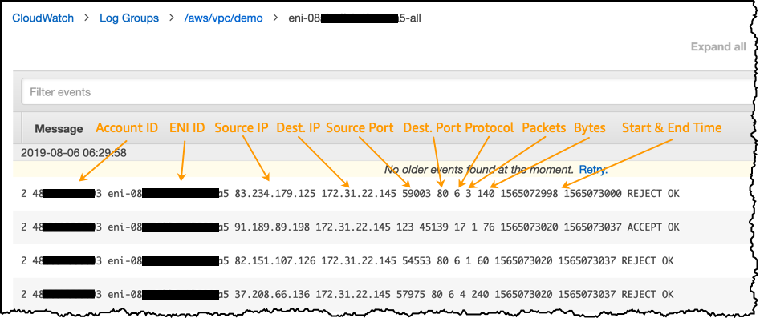

## AWS Cloudtrail
AWS Cloudtrail logs the AWS API activities from Console, SDK, CLI and AWS Services eg. create Bucket, launch EC2 etc.  
CloudTrail EventLogs has
* CloudTrail Management Events -> Create VPC, Create S3 Bucket...  
* CloudTrail Data Events -> Get S3 Objects, List S3 Objects...
* CloudTrail Insights Events -> capture unusual activity that is detected in your account.

Both Management and Data Events can be further filtered to Choose the activities you want to log.
  * Read
  * Write
  * Exclude AWS KMS events
  * Exclude Amazon RDS Data API events

We can create trails which put logs from CloudTrail into S3 and optionally into CloudWatch Logs also  

To determine whether a log file was modified, deleted, or unchanged after CloudTrail delivered it, you can use **CloudTrail log file integrity validation.**   
When you enable log file integrity validation, CloudTrail creates a hash for every log file that it delivers.   
Every hour, CloudTrail also creates and delivers a file that references the log files for the last hour and contains a hash of each. This file is called a digest file.  
CloudTrail signs each digest file using the private key of a public and private key pair. After delivery, you can use the public key to validate the digest file.

This makes it computationally infeasible to modify, delete or forge CloudTrail log files without detection. You can use the AWS CLI to validate the files in the location where CloudTrail delivered them. 

#### Monitoring and Action
eg. We can add EventBridge rules 
```text
  "detail-type": "AWS API Call via CloudTrail",
  "source": "aws.s3"
```

## AWS Security Hub
Security Hub is a central security tool which aggregates alerts from other Security Tools like GuardDuty, Inspector, Macie, IAM Access Analyzer, AWS Systems Manager, AWS Firewall Manager, AWS Partner Network Solutions

**We must first enable the AWS Config Service to use Security Hub**

When setting up Security Hub, we must enable/disable security standards like: 
* CIS AWS Foundations,
* PCI DSS
* AWS Foundational Security Best Practices

#### Monitoring and Action
eg. We can add EventBridge Rule on 
```text
  "detail-type": "Security Hub Findings - Imported",
  "source": "aws.securityhub",
```


## AWS Config
AWS Config manages rules which define a set of desired configuration settings. The pre-built AWS rules (over 75) evaluate provisioning and configuring of AWS resources. 
eg. 
* Ensure Lambda functions are deployed inside a VPC, 
* Enable backups for RDS DB instances, 
* Disable public read for S3 bucket
* Audit IAM Policies 
* Detect if CloudTrail has been disabled 
* Detect if EC2 instances are created with unapproved AMIs 
* Detect if Security Groups are open to the public 
* Detect if Internet Gateway is added to unauthorized VPC 
* Detect if EBS volumes are encrypted 
* Detect if RDS databases are public

AWS Config also has the ability to **record changes to the configuration of your IAM users, groups, and roles and the policies associated with them.**  
AWS Config automatically records changes to any of these resources, and gives you a full history of the previous configurations for these resources.  
With this information, you can determine, for example, if an IAM user has used policies that gave him access to certain resources or if certain actions were permitted at any point in the past.  
The AWS Config console includes a timeline view of this information.


#### Monitoring and Action
We can add EventBridge rules on 
```text
  "detail-type": "Config Rules Compliance Change",
  "source": "aws.config",
```

## AWS GuardDuty 
AWS GuardDuty is a **MACHINE LEARNING** based **NEAR-REAL TIME** anomaly and threat detection service to identify suspicious activity, such as unauthorized access attempts and malicious IP addresses.  
It monitors
* CloudTrail EventLogs, 
* VPC Flow Logs
* DNS Logs
* Kubernetes Audit Logs
* **Can protect against CryptoCurrency attacks** (has a dedicated “finding” for it)

**GuardDuty does not store logs or historical findings**

#### Suppression rules
A suppression rule is a set of criteria, consisting of a filter attribute paired with a value, used to filter findings by automatically archiving new findings that match the specified criteria.   
Suppression rules can be used to filter low-value findings, false positive findings, or threats you do not intend to act on, to make it easier to recognize the security threats with the most impact to your environment.  
After you create a suppression rule, new findings that match the criteria defined in the rule are automatically archived as long as the suppression rule is in place. 

Suppressed findings are not sent to AWS Security Hub, Amazon S3, Detective, or CloudWatch, reducing finding noise level

#### Monitoring and Action
We can add EventBridge rules
```text
  "detail-type": "GuardDuty Finding",
  "source": "aws.guardduty",
```


## AWS Inspector
Amazon Inspector only **evaluates EC2 instances, Container Images & Lambda functions** for software vulnerabilities (against database of CVE) and unintended network exposure.

#### Monitoring and Action
We can add EventBridge rules on
```text
  "detail-type": "Inspector2 Finding",
  "source": "aws.inspector2",
```

## AWS Detective
AWS Detective provides investigative process with prebuilt data aggregations, summaries, and context for DEEP root cause analysis   
It automatically collects and processes events from VPC Flow Logs, CloudTrail, and GuardDuty to create a unified view


## AWS Trusted Advisor
AWS Trusted Advisor analyses your AWS account and provides Free recommendations for
1. **Cost Optimization**: eg. low utilization EC2 instances, idle load balancers, under-utilized EBS volumes… , Reserved instances & savings plans optimizations, 
2. **Performance**: eg High utilization EC2 instances, CloudFront CDN optimizations, EC2 to EBS throughput optimizations, Alias records recommendations
3. **Security**: MFA enabled on Root Account, IAM key rotation, exposed Access Keys, S3 Bucket Permissions for public access, security groups with unrestricted ports 
4. **Fault Tolerance**: EBS snapshots age, Availability Zone Balance, ASG Multi-AZ, RDS Multi-AZ, ELB configuration… 
5. **Service Limits**

#### Monitoring and Action
We can add EventBridge rules on 
```text
  "detail-type": "Trusted Advisor Check Item Refresh Notification",
  "source": "aws.trustedadvisor",
```


## Penetration Testing on AWS Cloud
AWS customers are welcome to carry out security assessments or penetration tests against their AWS infrastructure without prior approval for 8 services:
* Amazon EC2 instances, NAT Gateways, and Elastic Load Balancers
* Amazon RDS
* Amazon CloudFront
* Amazon Aurora
* Amazon API Gateways
* AWS Lambda and Lambda Edge functions
* Amazon Lightsail resources
* Amazon Elastic Beanstalk environments

#### Prohibited Activities
* DNS zone walking via Amazon Route 53 Hosted Zones
* Denial of Service (DoS), Distributed Denial of Service (DDoS), Simulated DoS, Simulated DDoS
* Port flooding
* Protocol flooding
* Request flooding (login request flooding, API request flooding)


## AWS Audit Manager
AWS Audit Manager maps your compliance requirements to AWS usage data with prebuilt and custom frameworks and automated evidence collection to **generate compliance reports alongside evidence folders**. Prebuilt Frameworks include
* CIS AWS Foundations Benchmark 1.2.0 & 1.3.0
* General Data Protection Regulation (GDPR),
* Health Insurance Portability and Accountability Act (HIPAA)
* Payment Card Industry Data Security Standard (PCI DSS) v3.2.1
* Service Organization Control 2 (SOC 2)


## VPC Flow Logs
VPC Flow Logs capture information about IP traffic going into interfaces (to either Cloudwatch or S3) at either
* VPC Level
* Subnet Level
* Elastic Network Interface (ENI) level




### The following traffic is NOT CAPTURED
* Traffic to Amazon DNS server (custom DNS server traffic is logged)
* Traffic for Amazon Windows license activation
* Traffic to and from 169.254.169.254 for EC2 instance metadata
* Traffic to and from 169.254.169.123 for Amazon Time Sync service
* DHCP traffic
* Mirrored traffic
* Traffic to the VPC router reserved IP address (e.g., 10.0.0.1)
* Traffic between VPC Endpoint ENI and Network Load Balancer ENI


## AWS Macie
AWS Macie Used to analyze and identify sensitive data in your S3 buckets usin
1. **Managed Data Identifier** - > A set of built-in criteria that are designed to detect specific type of sensitive data e.g. credit cards numbers, AWS Credentials, bank accounts
2. **Custom Data Identifier** -> A set of criteria that you define to detect sensitive data using Regular expression, keywords eg. employee IDs, customer account numbers  
You can use Allow Lists to define a text pattern to ignore (e.g., public phone numbers)

#### Monitoring and Action
We can add EventBridge rules on 
```text
  "detail-type": "Macie Finding",
  "source": "aws.macie",
```

## Unified CloudWatch Agent
Collect additional system-level metrics such as RAM, processes, used disk space, etc from EC2 instances, on-premises servers, …)
No logs from inside your EC2 instance will be sent to CloudWatch Logs without using an agent


## AWS Athena
Amazon Athena – Federated Query allows you to run SQL queries across data stored in relational, non-relational, object, and custom data sources (AWS or on-premises). It uses Data Source Connectors that run on AWS Lambda to run Federated Queries (e.g., CloudWatch Logs, DynamoDB, RDS, …) and stores the results back in Amazon S3.

The permissions required to run Athena queries include the following:
* Amazon S3 locations where the underlying data to query is stored.
* Metadata and resources that you store in the AWS Glue Data Catalog, such as databases and tables, including additional actions for encrypted metadata.
* Athena API actions.


## AWS WAF
You use AWS WAF to protect your web applications from common web exploits (Layer 7).  
You do this by defining a web access control list (ACL) and then associating it with one or more web application resources that you want to protect.

Can be deployed on
* Application Load Balancer (localized rules)
* API Gateway (rules running at the regional or edge level)
* CloudFront (rules globally on edge locations)
  * Used to front other solutions: CLB, EC2 instances, custom origins, S3 websites
* Deploy on AppSync (protect your GraphQL APIs)

Define Web ACL (Web Access Control List):
* Rules can include IP addresses, HTTP headers, HTTP body, or URI strings
* Protects from common attack - SQL injection and Cross-Site Scripting (XSS)
* Size constraints, Geo match
* Rate-based rules (to count occurrences of events)
* Rule Actions: Count | Allow | Block | CAPTCHA

You can instruct **AWS WAF to insert custom headers into the original HTTP request** when a rule action doesn't block the request.  
With this option, you only add to the request. You can't modify or replace any part of the original request.  
Use cases for custom header insertion include signaling a downstream application to process the request differently based on the inserted headers, and flagging the request for analysis.

AWS WAF is tightly integrated with Amazon CloudFront and the Application Load Balancer (ALB), services that AWS customers commonly use to deliver content for their websites and applications.

When you use AWS WAF on Amazon CloudFront, your rules run in all AWS Edge Locations, located around the world close to your end users. This means security doesn’t come at the expense of performance. Blocked requests are stopped before they reach your web servers. 

When you use AWS WAF on Application Load Balancer, your rules run in region and can be used to protect internet-facing as well as internal load balancers.


### AWS WAF – Managed Rules

Library of over 190 Ready-to-use rules that are managed by AWS and AWS Marketplace Sellers

#### Baseline Rule Groups – general protection from common threats
  AWSManagedRulesCommonRuleSet, AWSManagedRulesAdminProtectionRuleSet, …
#### Use-case Specific Rule Groups – protection for many AWS WAF use cases
 AWSManagedRulesSQLiRuleSet, AWSManagedRulesWindowsRuleSet, 
 AWSManagedRulesPHPRuleSet, AWSManagedRulesWordPressRuleSet, …
#### IP Reputation Rule Groups – block requests based on source (e.g., malicious IPs)
  AWSManagedRulesAmazonIpReputationList, AWSManagedRulesAnonymousIpList
####Bot Control Managed Rule Group – block and manage requests from bots
  AWSManagedRulesBotControlRuleSet

## AWS Shield 
AWS Shield, a managed Distributed Denial of Service (DDoS) protection service that safeguards applications running on AWS

#### AWS Shield Standard:
* Free service that is activated for every AWS customer
* Provides protection from attacks such as SYN/UDP Floods, Reflection attacks and other layer 3/layer 4 attacks

#### AWS Shield Advanced:
* Optional DDoS mitigation service ($3,000 per month per organization)
* Protect against more sophisticated attack on Amazon EC2, Elastic Load Balancing (ELB), Amazon CloudFront, AWS Global Accelerator, and Route 53
* 24/7 access to AWS DDoS response team (DRP)
* Protect against higher fees during usage spikes due to DDoS
* Shield Advanced automatic application layer DDoS mitigation automatically creates, evaluates and deploys AWS WAF rules to mitigate layer 7 attacks

### Shield Advanced CloudWatch Metrics
* Helps you to detect if there’s a DDoS attack happening
* DDoSDetected – indicates whether a DDoS event is happening for a specific resource
* DDoSAttackBitsPerSecond – number of bits per second during a DDoS event for a specific resource
* DDoSAttackPacketsPerSecond – number of packets per second during a DDoS event for a specific resource
* *DDoSAttackRequestsPerSecond – number of requests per second during a DDoS event for a specific resource

## AWS Firewall Manager
Manage rules in all accounts of an AWS Organization

Security policy: common set of security rules
* WAF rules (Application Load Balancer, API Gateways, CloudFront)
* AWS Shield* Advanced (ALB, CLB, NLB, Elastic IP, CloudFront)
* Security Groups for EC2, Application Load BAlancer and ENI resources in VPC
* AWS Network Firewall (VPC Level)
* Amazon Route 53 Resolver DNS Firewall
* Policies are created at the region level
* Rules are applied to new resources as they are created (good for compliance) across all and future accounts in your Organization

## AWS Site to Site VPN
AWS Site to Site VPN connects AWS VPC to Customer On-Premise VPC using
1. **Virtual Private Gateway(VGW)** is created and attached to the AWS VPC from which you want to create the Site-to-Site VPN connection
2. **Customer Gateway (CGW)** is Software application or physical device on customer side of the VPN connection

Route Propagation or VPG must be ENABLED in the route table associated with your subnets


## AWS VPN CloudHub

Customer networks can communicate with each other also, if connected to the same VGW
We need to enable dynamic routing and configure route tables


## AWS S3 Access Points
AWS S3 Access Points simplify security management for S3 Buckets,   
Each access point has
1. its own DNS name (Internet Origin or VPC Origin)
2. an access point policy (similar to bucket policy) – manage security at scale

1. If using VPC Endpoint, we must enable VPC Endpoint to access Access Point via Endpoint Policy
2. When using S3 Access Point, we can enable all S3 API calls to use Access Point only, hence enforcing VPC Endpoints to interact with S3 bucket


## Providing access to third parties to your AWS Account
For example, a third party might provide a service for managing your AWS resources. With IAM roles, the third party can access your AWS resources by assuming a role that you create in your AWS account. 

Third parties must provide you with the following information for you to create a role that they can assume:
* The third party's AWS account ID. You specify their AWS account ID as the principal when you define the trust policy for the role.
* An external ID to uniquely associate with the role. The external ID can be any identifier that is known only by you and the third party. For example, you can use an invoice ID between you and the third party, but do not use something that can be guessed, like the name or phone number of the third party. You must specify this ID when you define the trust policy for the role. The third party must provide this ID when they assume the role.
* The permissions that the third party requires to work with your AWS resources. You must specify these permissions when defining the role's permission policy. This policy defines what actions they can take and what resources they can access.

After you create the role, you must provide the role's Amazon Resource Name (ARN) to the third party. They require your role's ARN in order to assume the role.

```text
{
  "Version": "2012-10-17",
  "Statement": {
    "Effect": "Allow",
    "Principal": {
      "AWS": "Example Corp's AWS Account ID"
    },
    "Action": "sts:AssumeRole",
    "Condition": {
      "StringEquals": {
        "sts:ExternalId": "12345"
      }
    }
  }
}
```


## AWS S3 Glacier Vault
A S3 Glacier Vault is a container for storing archives. 

**S3 Glacier Vault Lock** helps you to easily enforce compliance controls for S3 Glacier vaults with a Vault Lock policy. You can 
* specify controls such as "write once read many" (WORM) in a Vault Lock policy and 
* lock the policy from future edits.
* Block an object version deletion for a specified amount of time
* Put a **Legal Hold** (which add a Resource Tag based Policy)
  * protect the object indefinitely, independent of retention period 
  * can be freely placed and removed using the s3:PutObjectLegalHold IAM permission
* When we initiate a lock by attaching a vault lock policy to your vault, which sets the lock to an in-progress state and returns a lock ID. **While in the in-progress state, you have 24 hours to validate your vault lock policy before the lock ID expires.**


As an example of a Vault Lock policy, suppose that you are required to retain archives for one year before you can delete them. 
To implement this requirement, you can create a Vault Lock policy that denies users permissions to delete an archive until the archive has existed for one year. 
You can test this policy before locking it down. After you lock the policy, the policy becomes immutable

```text
{
   "Version":"2012-10-17",
   "Statement":[
      {
         "Sid": "deny-based-on-archive-age",
         "Principal": "*",
         "Effect": "Deny",
         "Action": "glacier:DeleteArchive",
         "Resource": [
            "arn:aws:glacier:us-west-2:123456789012:vaults/examplevault"
         ],
         "Condition": {
            "NumericLessThan" : {
                  "glacier:ArchiveAgeInDays" : "365"
                  }
         }
      }
    ]
}       
```

Suppose that you have a time-based retention rule that an archive can be deleted if it is less than a year old.  
At the same time, suppose that you need to place a legal hold on your archives to prevent deletion or modification for an indefinite duration during a legal investigation.   
**In this case, the legal hold takes precedence over the time-based retention rule specified in the Vault Lock policy.**

```text
 {
   "Version":"2012-10-17",
   "Statement":[
      {
         "Sid": "lock-vault",
         "Principal": "*",
         "Effect": "Deny",
         "Action": [ "glacier:DeleteArchive" ],
         "Resource": [ "arn:aws:glacier:us-west-2:123456789012:vaults/examplevault" ],
         "Condition": {
            "StringLike": {
               "glacier:ResourceTag/LegalHold": [ "true" ]
            }
         }
      },
      {
         "Sid": "you-can-delete-archive-less-than-1-year-old",
         "Principal": { "AWS": "arn:aws:iam::123456789012:root" },
         "Effect": "Allow",
         "Action": [ "glacier:DeleteArchive" ],
         "Resource": [ "arn:aws:glacier:us-west-2:123456789012:vaults/examplevault" ],
         "Condition": {
            "NumericLessThan": {
               "glacier:ArchiveAgeInDays": "365"
            }
         }
      }
   ]
}
```

There are two retention modes for Vault Locks
#### Retention mode - Compliance:
* Object versions can't be overwritten or deleted by any user, including the root user 
* Objects retention modes can't be changed, and retention periods can't be shortened

#### Retention mode - Governance:
* Most users can't overwrite or delete an object version or alter its lock settings 
* Some users have special permissions to change the retention or delete the objec


## Instance Metadata
Instance metadata is data about your instance that you can use to configure or manage the running instance. 
Instance metadata is divided into categories, for example, host name, events, and security groups.

You can also use instance metadata to access user data that you specified when launching your instance. For example, you can specify parameters for configuring your instance, or include a simple script. You can build generic AMIs and use user data to modify the configuration files supplied at launch time. 


You can access instance metadata from a running instance using one of the following methods:
* Instance Metadata Service Version 1 (IMDSv1) – a request/response method
* Instance Metadata Service Version 2 (IMDSv2) – a session-oriented method

#### How Instance Metadata Service Version 2 works
IMDSv2 uses session-oriented requests. With session-oriented requests, you create a session token that defines the session duration, which can be a minimum of one second and a maximum of six hours. 
During the specified duration, you can use the same session token for subsequent requests. After the specified duration expires, you must create a new session token to use for future requests.

The following example uses a Linux shell script and IMDSv2 to retrieve the top-level instance metadata items. The example:

Creates a session token lasting six hours (21,600 seconds) using the PUT request
```text
[ec2-user ~]$ TOKEN=`curl -X PUT "http://169.254.169.254/latest/api/token" -H "X-aws-ec2-metadata-token-ttl-seconds: 21600"`
```

Requests the top-level metadata items using the token
```text
[ec2-user ~]$ curl -H "X-aws-ec2-metadata-token: $TOKEN" -v http://169.254.169.254/latest/meta-data/
```


## DHCP option sets in Amazon VPC
Dynamic Host Configuration Protocol (DHCP) option sets give you control over the following aspects of routing in your virtual network:
* You can control the DNS servers, domain names, or Network Time Protocol (NTP) servers used by the devices in your VPC.
* You can disable DNS resolution completely in your VPC.

#### What is DHCP?
Every device on a TCP/IP network requires an IP address to communicate over the network. In the past, IP addresses had to be assigned to each device in your network manually. Today, IP addresses are assigned dynamically by DHCP servers using the Dynamic Host Configuration Protocol (DHCP).

Applications running on EC2 instances in subnets can communicate with Amazon DHCP servers as needed to retrieve their IP address lease or other network configuration information (such as the IP address of an Amazon DNS server or the IP address of the router in your VPC).

Amazon VPC enables you to specify the network configurations that are provided by Amazon DHCP servers by using DHCP option sets.


## Cloudfront Private Content

To use private content with Amazon CloudFront, you’ll need an Amazon CloudFront distribution with private content enabled and a list of authorized accounts you trust to access your private content. 

From the Create Distribution Wizard in the Amazon CloudFront console, start creating a web distribution. In the ”’Origin Settings”’ section, select an Amazon S3 bucket that you’ve created for private content only, and make sure you select the options as below:


This will set the permissions on your Amazon S3 bucket to protect your content from being accessed publicly, but still allow CloudFront to access your content.


Continue creating your distribution, and at the bottom of the Default Cache Behavior Settings section, make sure you enable the Restrict Viewer Access option and select self as the trusted signer. These are called trusted signers because you’re trusting URLs that are signed by them and allowing them to access your private content. In our example, we’re using self as the only trusted signer, which means that only your account can sign URLs to access your CloudFront private content.

